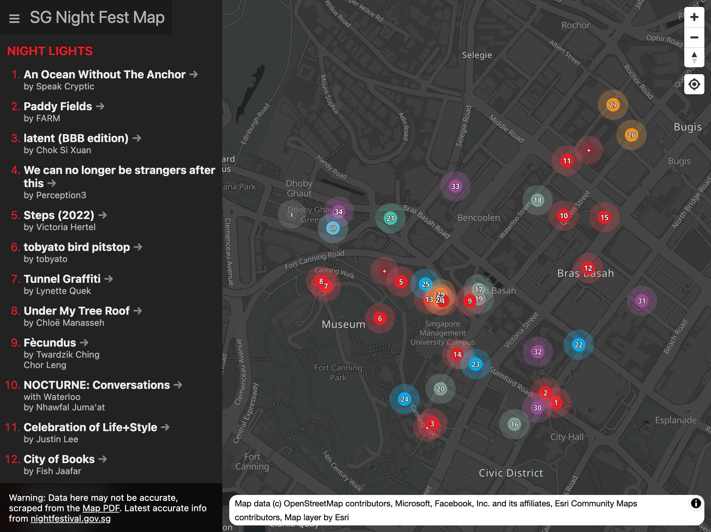
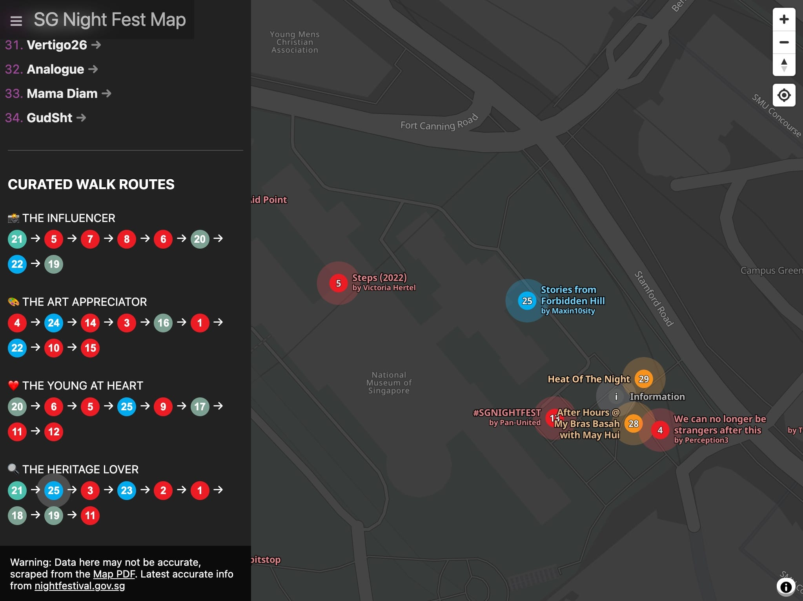

SG Night Fest Map
===

This is an attempt to recreate the map of the [Singapore Night Festival](https://www.nightfestival.gov.sg/) (2022).

The data is from the [PDF](https://www.nightfestival.gov.sg/-/media/Snf2022/SNF2022FestivalMap.pdf) instead of their [web map](https://www.nightfestival.gov.sg/festival-map).
- I didn't know they have a web map before I build this. But somehow their web map data is slightly different from the PDF data (PDF has some extra info and lack some info compared to web map).
- The points are not accurate and roughly estimated.

Here are some nice screenshots:

Development stuff:

1. Rename `.env.example` to `.env`
2. Add your [ArcGIS](https://developers.arcgis.com/) token to `VITE_ARCGIS_TOKEN`.
3. `npm i` to install dependencies
4. `npm run dev` to start local server

I don't know if this is going to be useful for anyone including myself.

Let's cross our fingers 🤞